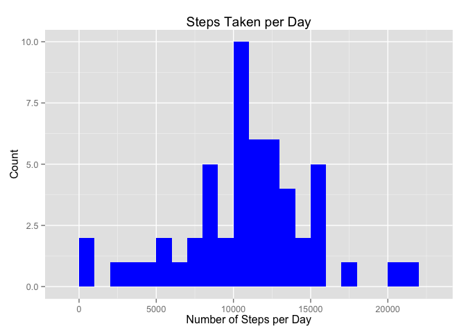
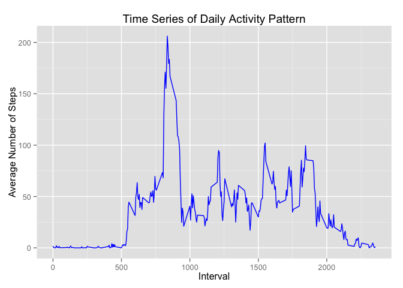
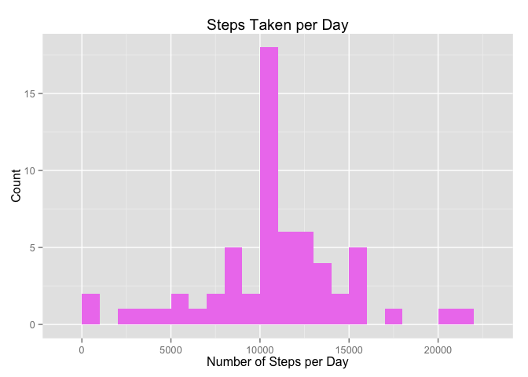
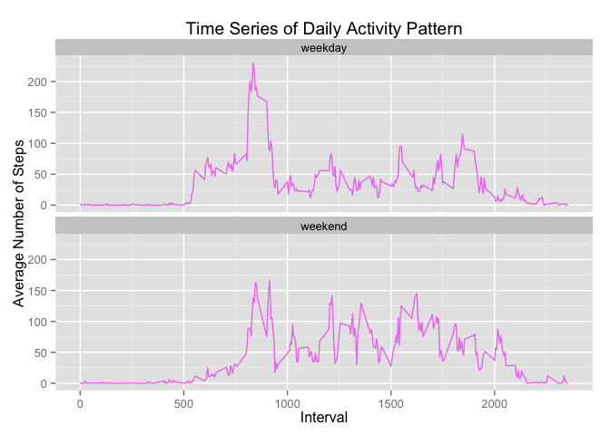

# Reproducible Research: Peer Assessment 1
Karen Yong  
September 13, 2015  

## Loading and preprocessing the data
1. Load the data (i.e. read.csv())

```r
activity <- read.csv("activity.csv")
```

2. Process/transform data (if necessary) into format suitable for analysis

```r
#convert date field from characters to date format
activity$date <- as.Date(activity$date, "%Y-%m-%d")
#convert interval to factor
activity$interval <- as.factor(activity$interval)
```

## What is mean total number of steps taken per day?
1. Calculate the total number of steps taken per day

```r
totalsteps <- aggregate(steps~date, activity, sum)
```

We display the first few rows of the new dataframe "totalsteps""

```r
head(totalsteps)
```

```
##         date steps
## 1 2012-10-02   126
## 2 2012-10-03 11352
## 3 2012-10-04 12116
## 4 2012-10-05 13294
## 5 2012-10-06 15420
## 6 2012-10-07 11015
```

2. Make a histogram of the total number of steps taken each day

```r
library(ggplot2)
ggplot(totalsteps, aes(x = steps)) + geom_histogram(fill = "blue", binwidth = 1000) + 
        labs(title="Steps Taken per Day", x = "Number of Steps per Day", y = "Count")
```

 

3. Calculate and report the mean and median of the total number of steps taken per day

```r
#calculate mean of total number of steps
meansteps <- mean(totalsteps$steps, na.rm=TRUE)
meansteps
```

```
## [1] 10766.19
```

```r
#calculate median of total number of steps
medsteps <- median(totalsteps$steps, na.rm=TRUE)
medsteps
```

```
## [1] 10765
```
The mean number of steps taken is **10766.19** and the median number of steps taken is **10765**.

## What is the average daily activity pattern?
1. Make a time series plot (i.e. type = "l") of the 5-minute interval (x-axis) and the average number of steps taken, averaged across all days (y-axis)

```r
#calculate average steps per interval
dailyavg <- aggregate(steps ~ interval, activity, mean, na.rm=TRUE)
#convert intervals from factor to numeric
dailyavg$interval <- as.numeric(as.character(dailyavg$interval))

#time series plot
ggplot(dailyavg, aes(x=interval, y=steps)) + geom_line(color="blue") +   
        labs(title="Time Series of Daily Activity Pattern", x="Interval", 
             y="Average Number of Steps") 
```

 

2. Which 5-minute interval, on average across all the days in the dataset, contains the maximum number of steps?

```r
maxsteps <- dailyavg[which.max(dailyavg$steps),]
maxsteps$steps <- round(maxsteps$steps)
```
The **835th** interval contains a maximum of **206** steps.

## Imputing missing values
1. Calculate and report the total number of missing values in the dataset (i.e. the total number of rows with NAs)

```r
missvalue <- sum(is.na(activity))
missvalue
```

```
## [1] 2304
```
The total number of missing values in the activity dataset is **2304**.

2. Devise a strategy for filling in all of the missing values in the dataset. The strategy does not need to be sophisticated. For example, you could use the mean/median for that day, or the mean for that 5-minute interval, etc.

We will use the mean of steps per interval to replace the missing values in the activity dataset.

```r
#store original activity dataset in new dataframe 'activitynew'
activitynew <- activity
#store index of missing values into variable 'nas'
nas <- is.na(activitynew$steps)
#return mean of steps by intervals while ignoring NAs as vector
avg_interval <- tapply(activitynew$steps, activitynew$interval, mean, na.rm=TRUE, simplify=TRUE)
```

3. Create a new dataset that is equal to the original dataset but with the missing data filled in.

```r
#assign average values of steps to missing values according to intervals
activitynew$steps[nas] <- avg_interval[as.character(activitynew$interval[nas])]
```

Check if there are anymore missing values in the activitynew dataframe

```r
sum(is.na(activitynew$steps))
```

```
## [1] 0
```

We display the first few rows of the new dataframe activitynew

```r
head(activitynew)
```

```
##       steps       date interval
## 1 1.7169811 2012-10-01        0
## 2 0.3396226 2012-10-01        5
## 3 0.1320755 2012-10-01       10
## 4 0.1509434 2012-10-01       15
## 5 0.0754717 2012-10-01       20
## 6 2.0943396 2012-10-01       25
```

4. Make a histogram of the total number of steps taken each day and Calculate and report the mean and median total number of steps taken per day. Do these values differ from the estimates from the first part of the assignment? What is the impact of imputing missing data on the estimates of the total daily number of steps?

```r
#calculate average steps per date
totalstepsnew <- aggregate(steps~date, activitynew, sum)
ggplot(totalstepsnew, aes(x = steps)) + geom_histogram(fill = "violet", binwidth = 1000) + 
        labs(title="Steps Taken per Day", x = "Number of Steps per Day", y = "Count")
```

 

```r
meanstepsnew <- mean(totalstepsnew$steps)
meanstepsnew
```

```
## [1] 10766.19
```

```r
medstepsnew <- median(totalstepsnew$steps)
medstepsnew
```

```
## [1] 10766.19
```

Yes, the values do differ slightly. 

Before replacing the missing values the mean and median are different:

Mean : **10766.19**  
Median: **10765**

After replacing the missing values with the mean of steps per interval, the mean and median are now the same:

Mean : **10766.19**  
Median: **10766.19**

## Are there differences in activity patterns between weekdays and weekends?
1. Create a new factor variable in the dataset with two levels – “weekday” and “weekend” indicating whether a given date is a weekday or weekend day.

```r
#convert dates to days
library(lubridate)
activitynew$day <- wday(activitynew$date, label=TRUE, abbr=FALSE)

#add new variable 'daytype' to indicate if it's a weekday or weekend
activitynew$daytype <- factor(activitynew$day)
     levels(activitynew$daytype) <- list(
          weekday=c("Monday", "Tuesday", "Wednesday","Thursday","Friday"),
          weekend=c("Saturday","Sunday"))
```

We display the first few rows of the dataframe activitynew after adding variable 'daytype'

```r
head(activitynew)
```

```
##       steps       date interval    day daytype
## 1 1.7169811 2012-10-01        0 Monday weekday
## 2 0.3396226 2012-10-01        5 Monday weekday
## 3 0.1320755 2012-10-01       10 Monday weekday
## 4 0.1509434 2012-10-01       15 Monday weekday
## 5 0.0754717 2012-10-01       20 Monday weekday
## 6 2.0943396 2012-10-01       25 Monday weekday
```

2. Make a panel plot containing a time series plot (i.e. type = "l") of the 5-minute interval (x-axis) and the average number of steps taken, averaged across all weekday days or weekend days (y-axis). See the README file in the GitHub repository to see an example of what this plot should look like using simulated data.

```r
#calculate average steps per weekday/weekend and interval
dailyavgnew <- aggregate(steps ~ daytype + interval, activitynew, mean)

#convert intervals from factor to numeric
dailyavgnew$interval <- as.numeric(as.character(dailyavgnew$interval))

ggplot(dailyavgnew, aes(x=interval, y=steps)) + geom_line(color="violet") +   
        labs(title="Time Series of Daily Activity Pattern", x="Interval", 
             y="Average Number of Steps") + facet_wrap(~ daytype, nrow=2, ncol=1)
```

 
